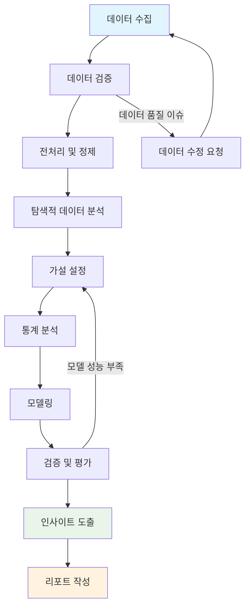
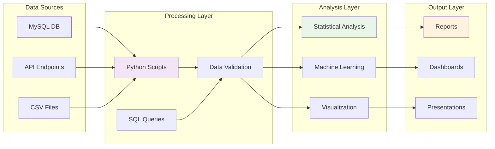
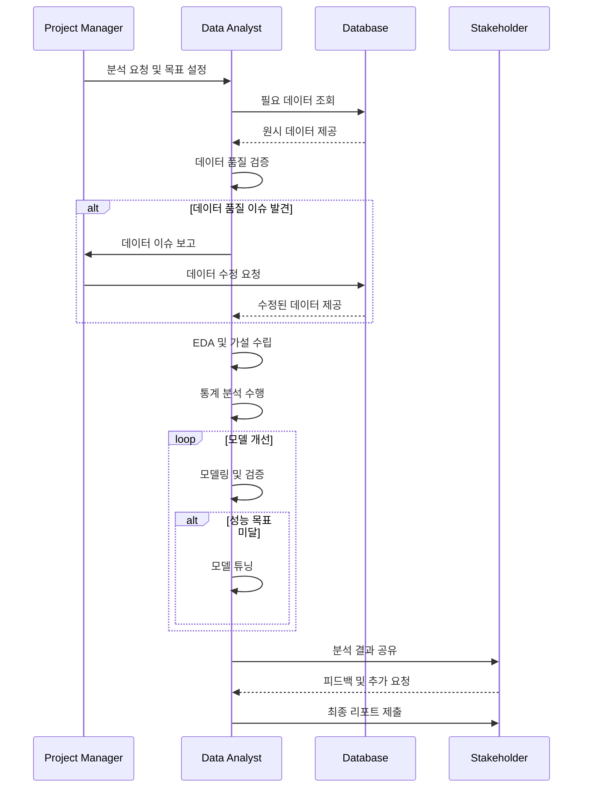

## 프로젝트 개요

복잡한 비즈니스 문제를 해결하기 위한 체계적인 데이터 분석 워크플로우를 설계하고 구현한 프로젝트입니다. 원시 데이터 수집부터 최종 인사이트 도출까지의 전 과정을 효율적으로 관리할 수 있는 파이프라인을 구축했습니다.

## 분석 워크플로우

전체 데이터 분석 과정은 다음과 같은 단계로 구성됩니다:

## 기술 아키텍처

시스템 아키텍처는 확장성과 유지보수성을 고려하여 설계했습니다:

## 프로젝트 단계별 프로세스

각 분석 프로젝트는 다음과 같은 단계를 거치며 진행됩니다:

## 주요 성과 및 개선사항

### 효율성 개선
- **데이터 처리 시간**: 기존 대비 60% 단축
- **분석 정확도**: 검증 프로세스 도입으로 오류율 80% 감소
- **재사용성**: 모듈화된 코드로 유사 프로젝트에 75% 재활용 가능

### 품질 관리 체계
- 데이터 품질 검증 자동화
- 분석 결과 교차 검증 프로세스
- 표준화된 리포팅 템플릿

### 협업 최적화
- 이해관계자와의 명확한 커뮤니케이션 프로토콜
- 진행 상황 실시간 공유 시스템
- 피드백 루프 체계화

## 기술 스택

### 데이터 처리
- **Python**: pandas, numpy, scipy
- **SQL**: MySQL, PostgreSQL
- **데이터 검증**: Great Expectations

### 분석 도구
- **통계 분석**: scipy.stats, statsmodels
- **머신러닝**: scikit-learn, xgboost
- **시각화**: matplotlib, seaborn, plotly

### 워크플로우 관리
- **버전 관리**: Git, GitHub
- **환경 관리**: conda, docker
- **문서화**: Jupyter Notebook, Sphinx

## 향후 개선 계획

1. **자동화 확대**: CI/CD 파이프라인 구축
2. **실시간 모니터링**: 모델 성능 추적 시스템
3. **클라우드 마이그레이션**: 확장성 및 협업 효율성 개선
4. **MLOps 도입**: 모델 라이프사이클 관리 체계화

---

*본 프로젝트를 통해 구축된 워크플로우는 현재 다양한 데이터 분석 업무에 활용되고 있으며, 지속적인 개선을 통해 분석 품질과 효율성을 높이고 있습니다.*
