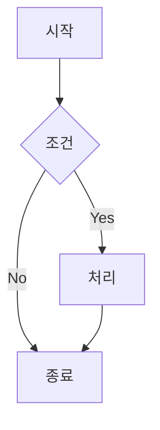
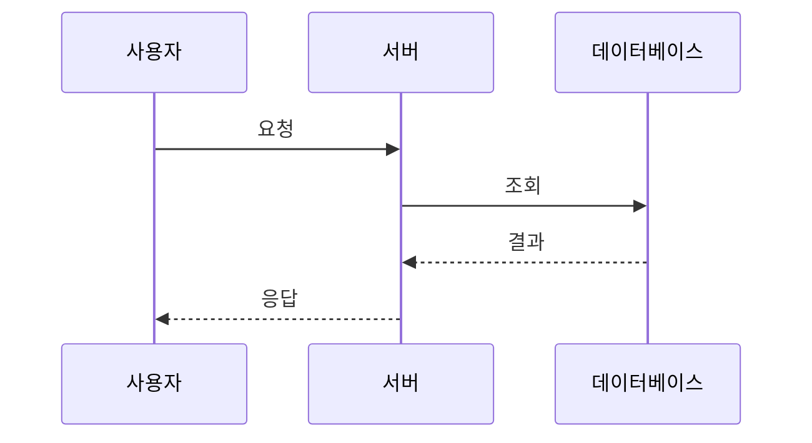

## Mermaid 다이어그램 테스트

### 방법 1: 코드 블록 (자동 변환)

```mermaid
flowchart TD
    A[시작] --> B{조건}
    B -->|Yes| C[처리]
    B -->|No| D[종료]
    C --> D
```

### 방법 2: 직접 HTML div (수동)

graph LR
    A[데이터] --> B[분석]
    B --> C[결과]

### 방법 3: 복잡한 다이어그램

```mermaid
sequenceDiagram
    participant A as 사용자
    participant B as 서버
    participant C as 데이터베이스
    
    A->>B: 요청
    B->>C: 조회
    C-->>B: 결과
    B-->>A: 응답
```
