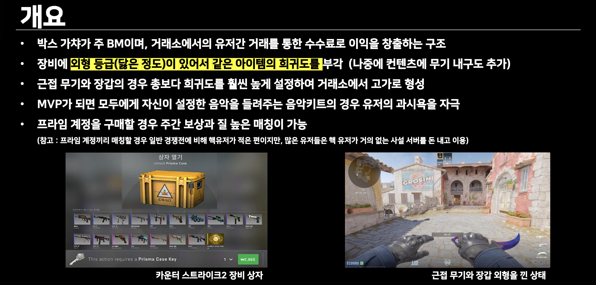

## 분석 배경

Counter-Strike 2는 F2P 전환 이후에도 Steam에서 최고 동시 접속자를 기록하며 성공적인 수익화를 달성했습니다. 이 게임이 "게임 밸런스를 해치지 않으면서도 높은 매출을 만드는 방법"을 어떻게 구현했는지 분석하여, 신규 TPS 프로젝트에 적용 가능한 BM 인사이트를 도출하고자 했습니다.

## 분석 내용

## 신규 프로젝트 적용 방안

#### 1. 코스튬 내구도 시스템

좀비 서바이벌 세계관에 맞춰 코스튬에 내구도를 도입하고, 닳은 정도에 따라 외형이 변화하도록 설계합니다.

**내구도 0~100% 구간별 외형 변화:**

- 0~25%: 정상
- 25~75%: 변색, 얼룩
- 75~92%: 천 찢어짐
- 92~100%: 극심한 손상

**극저확률 "리폼 코스튬" (0.1%):**

- 내구도 100% 도달 시 특별한 디자인으로 변경
- 수리 불가 → 희소성 극대화
- 거래소 고가 형성

#### 2. 프라임 계정 + 시즌제

**기본 F2P:** 랭크/보상 없이 게임만 플레이 가능

**프라임 계정 (₩19,000):**

- 시즌 서버 입장 가능
- 주간 보상 (케이스 + 재화)
- 프라임 전용 매칭

**시즌 종료 후:** 캐릭터는 비시즌 서버로 이전 (디아블로4 방식)

**2~3년 후 확장팩 판매**로 수명 연장

#### 3. 유저 간 거래 활성화

**폐쇄형 게임 내 마켓:**

- 게임 재화로만 거래 (법적 리스크 회피)
- 거래 수수료 10~15% 징수
- 스킨을 "투자 자산"으로 인식하게 만들어 과금 유도

## 
