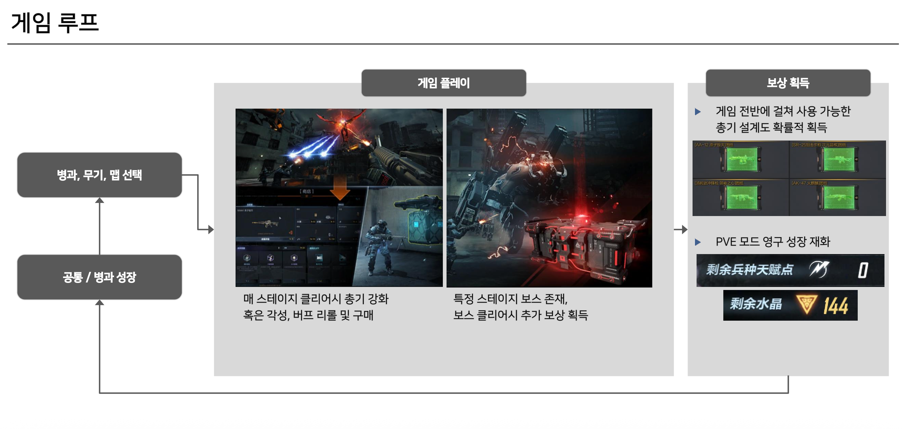
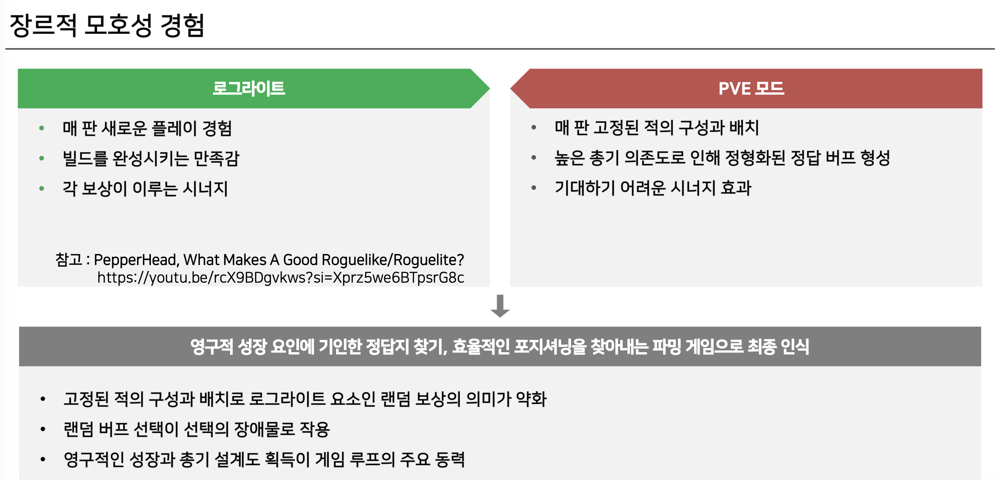
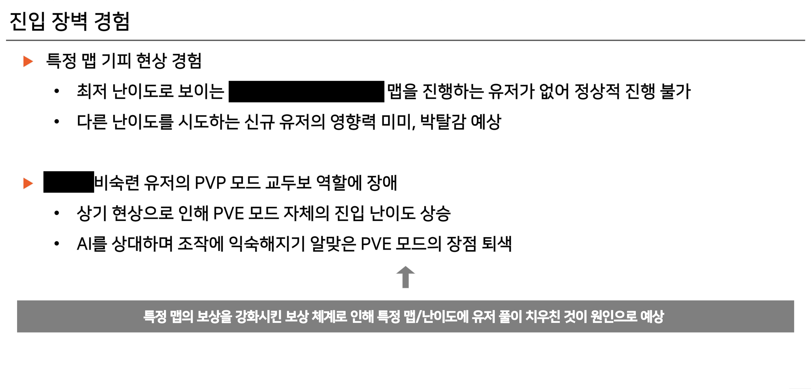
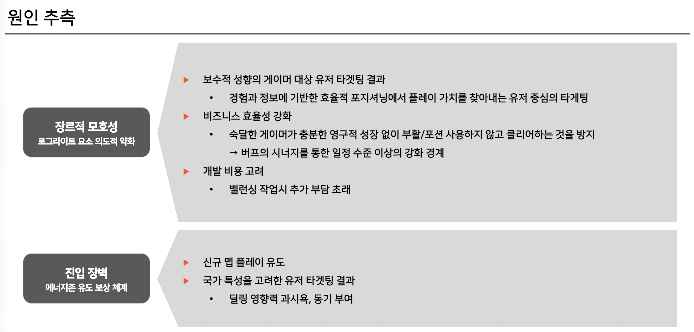

## 분석 배경

자사 게임의 PVE 모드는 영구 성장 요소가 있는 로그라이트 형식의 협동 콘텐츠입니다. 패키지 게임에서는 익숙한 장르지만 라이브 서비스에서는 드문 시도였기에, 실제 플레이를 통해 유저 이탈 우려 요소를 파악하고자 했습니다.

**게임 루프:**
1. 병과/무기/맵 선택
2. 게임 플레이 중 스테이지마다 총기 강화 또는 버프 선택
3. 보스 클리어 시 추가 보상 획득
4. 게임 전반에 사용 가능한 영구 성장 재화 획득

**연관 장르:**
- 1인칭 액션 슈팅 (Left 4 Dead 2)
- 협동 RPG
- 로그라이트 (Gunfire Reborn)

## 분석 내용

## 개선 제안

### 1. 지표 분석 필요

**맵/난이도별 플레이 점유율 분석:**

- 생키 다이어그램 등을 활용한 신규 유저 이탈 지점 파악
- 난이도별 유저 분포와 이탈 추세 확인

### 2. 유저 선호도 테스트

**로그라이트 요소 강화 이벤트:**
- 일정 기간 로그라이트 요소를 강화한 이벤트 모드 운영
- 기존 리소스 활용으로 개발 비용 최소화
- 벤치마킹: 원신 미니게임 형식

### 3. 장르 정체성 명확화

**장르의 의의:**
장르는 플레이어가 기대하는 가치를 담고, 이를 평가할 기준을 제시합니다. 게임성의 발전은 장르의 강점을 극대화하거나 한계를 돌파하는 방식에서 시작됩니다.

**장르적 모호성의 문제:**
- 핵심 재미요소의 충돌
- 유저 타겟층 설정의 모호성
- 개선 작업 시 개발 리소스 분산

**개선 방향:**
1. 로그라이트 강점 극대화 (랜덤성, 시너지, 빌드 다양성)
2. 또는 협동 슈팅 강점 극대화 (고정 구성 최적화, 전략적 포지셔닝)

둘 중 하나를 선택하여 장르 정체성을 명확히 해야 합니다.

## 결론

**핵심 인사이트:**
- 라이브 서비스에서 로그라이트 요소는 신중한 설계가 필요
- 보상 체계가 유저 분포를 결정하므로 진입 장벽 고려 필수
- 장르적 정체성 확립이 장기적 콘텐츠 발전의 기반

**다음 단계:**
지표 분석과 유저 테스트를 통해 로그라이트 강화 vs 협동 슈팅 최적화 중 방향성을 결정해야 합니다.
